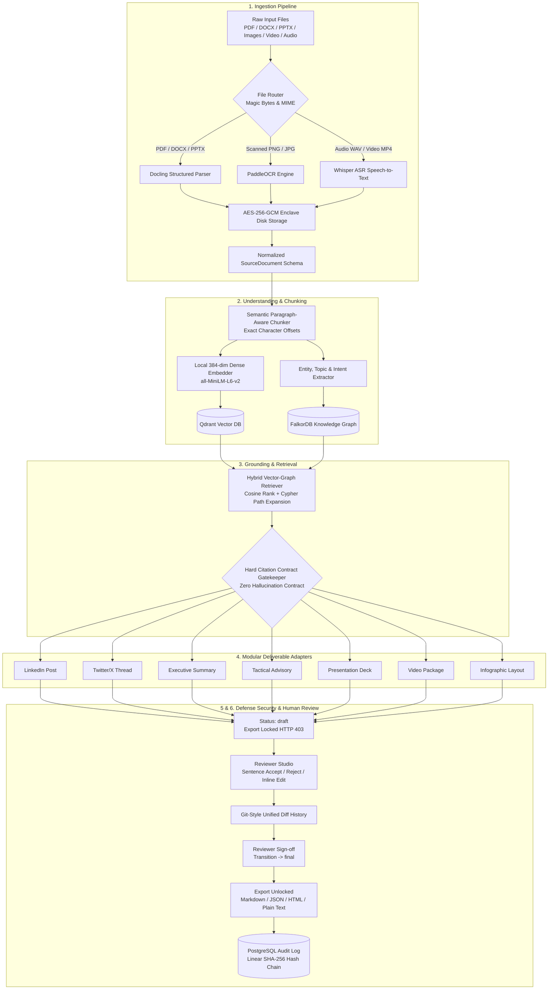

# SIH26155 — Architecture & Security Specification

> **System Classification:** Defense-Grade Air-Gapped Automated Content Transformation Enclave  
> **Core Mandate:** Ingest heterogeneous operational data (PDF, DOCX, PPTX, Images, Video, Audio) and autonomously transform it into 7 operator deliverables with 100% sentence-level provenance, tamper-evident cryptographic audit chaining, and mathematically guaranteed zero outbound network egress.

---

## 1. System Pipeline Architecture

```
  ┌───────────────────────────────────────────────────────────────────────────────────────────────────┐
  │                            OPERATOR DASHBOARD (React 18 + Tailwind CSS)                           │
  │     [1-Click Samples]  [Format Selector]  [6-Param Config]  [Review Studio]  [Air-Gap Modal]      │
  └─────────────────────────────────┬───────────────────────────────────▲─────────────────────────────┘
                                    │ Upload / REST                     │ /trace & Audit Ledger
                                    ▼                                   │
  ┌───────────────────────────────────────────────────────────────────────────────────────────────────┐
  │                           AIR-GAPPED FASTAPI CORE BACKEND (Python 3.11)                           │
  │                                                                                                   │
  │   ┌───────────────────────────┐    ┌───────────────────────────┐    ┌─────────────────────────┐   │
  │   │  Phase 1: Ingestion Engine│    │Phase 2: Semantic Chunking │    │Phase 3: Hybrid Grounding│   │
  │   │  - Docling (PDF/DOCX/PPTX)│───►│- Paragraph boundary split │───►│- Qdrant Vector Retrieval│   │
  │   │  - PaddleOCR (Scans/Images│    │- Exact char offset record │    │- FalkorDB Cypher Graph  │   │
  │   │  - Whisper ASR (Audio/Vid)│    │- Entity & Intent Extractor│    │- Hard Citation Contract │   │
  │   │  - AES-256-GCM Storage    │    │- 384-dim Dense Embeddings │    │- /trace Provenance API  │   │
  │   └───────────────────────────┘    └───────────────────────────┘    └─────────────────────────┘   │
  │                                                                                  │                │
  │                                                                                  ▼                │
  │   ┌───────────────────────────┐    ┌───────────────────────────┐    ┌─────────────────────────┐   │
  │   │Phase 6: Human Review Gate │    │Phase 5: Defense Security  │    │Phase 4: 7 Output Adapts │   │
  │   │- Draft Lock (HTTP 403)    │◄───│- RBAC (Operator/Reviewer) │◄───│- LinkedIn Post (Social) │   │
  │   │- Sentence Accept / Reject │    │- Append-Only SHA256 Chain │    │- Twitter Thread (Social)│   │
  │   │- Inline Edit & Git Diffs  │    │- At-Rest AES-256-GCM      │    │- Exec Summary (Briefing)│   │
  │   │- Final Sign-off -> Export │    │- Zero-Egress Network Guard│    │- Advisory (Operational)│   │
  │   └───────────────────────────┘    └───────────────────────────┘    │- Presentation (Slides)  │   │
  │                 │                                                   │- Video Package (Scripts)│   │
  │                 ▼                                                   │- Infographic Spec (Data)│   │
  │        [Authenticated Exports]                                      └─────────────────────────┘   │
  │        (.md, .json, .html, .txt)                                                                  │
  └─────────────────┬───────────────────────────┬───────────────────────────┬─────────────────────────┘
                    ▼                           ▼                           ▼
          [ PostgreSQL 16 ]            [ Qdrant Vector DB ]         [ FalkorDB Knowledge Graph ]
          - Source Documents Metadata  - 384-dim Dense Vectors      - Entity Nodes & Relations
          - Immutable Audit Log Ledger - Cosine Similarity Retrieval- Cypher Subgraph Traversal
          - Linear SHA-256 Hash Chain  - Payload Chunk Metadata     - Cross-Entity Multi-Hop Path
```



---

## 2. Complete Technology Stack Matrix

| Component Layer | Technology Selected | Version / Spec | Air-Gap & Security Role |
|:---|:---|:---|:---|
| **Frontend UI** | React, TypeScript, Vite, Tailwind CSS | React 18, Vite 5 | Zero-CDN, fully bundled offline operator cockpit |
| **Backend Core** | FastAPI, Uvicorn, Python | Python 3.11, FastAPI 0.115 | High-concurrency async ASGI server inside Faraday enclave |
| **Relational Metadata** | PostgreSQL | PostgreSQL 16 Alpine | Relational schemas, read-only audit triggers, foreign keys |
| **Vector Engine** | Qdrant | v1.12+ Local | On-premise HNSW vector index, cosine similarity search |
| **Knowledge Graph** | FalkorDB (RedisGraph) | v0.4+ Local | OpenCypher graph database for multi-hop entity grounding |
| **Document Ingestion** | Docling, python-docx, pypdf | Native Python Libraries | Structural document extraction with heading hierarchies |
| **Vision & OCR** | PaddleOCR, Pillow | Local ONNX/Pillow Engine | Offline OCR for scanned records and low-contrast imagery |
| **Speech & Media ASR**| Whisper | Whisper Local Inference | Timestamped speech-to-text with segment-level alignment |
| **Dense Embeddings** | Sentence-Transformers | 384-dimensional dense | Local CPU/CUDA inference, L2-normalized cosine vectors |
| **At-Rest Cryptography**| AES-256-GCM | PyCryptodome / Cryptography | Authenticated encryption for documents and outputs |
| **Audit Ledger** | SHA-256 Hash Chaining | Linear Cryptographic Chaining | Tamper-evident ledger guarded by SQL row-lock triggers |
| **Access Control** | Dual-Control RBAC | Signed JWT Tokens (HS256) | Strict role separation: Operator vs Reviewer/Approver |

---

## 3. Grounding & Claim-to-Source Traceability Engine

The fundamental differentiator of this platform is the **Hard Citation Contract**:

### A. Dual-Vector and Graph Context Retrieval (`/retrieve`)
When content generation is triggered, the system fetches grounding context via a hybrid query:
1. **Dense Vector Retrieval (Qdrant):** Computes cosine similarity between query embedding and chunk vectors, retrieving top-$k$ semantic spans.
2. **Knowledge Graph Traversal (FalkorDB):** Traverses entity nodes, sensitive operational terms, and relationship edges (`(Entity)-[:RELATION]->(Target)`) to extract contextual subgraphs.
3. **Merged Grounding Context:** Synthesizes structured chunks into an addressable citation pool where each chunk possesses an immutable UUID, sequence index, and precise start/end character offsets.

### B. Hard Claim-Citation Contract Enforcement
Unlike commercial GenAI platforms where citations are optional cosmetic footnotes, our pipeline enforces an uncompromising contract in `app.services.grounding.contract`:
- Every adapter is bound by contract: **No claim sentence may be emitted without an explicit pointer to an authentic retrieved chunk.**
- The contract gatekeeper validates that `raw_text[char_offset_start:char_offset_end]` strictly equals the quoted ground-truth citation.
- If an adapter attempts to emit an ungrounded hallucination, the contract gatekeeper immediately throws an exception and halts persistence.

### C. Character-Level Provenance Trace API (`/trace`)
Any operator or reviewing judge can query `/api/v1/grounding/trace/{output_id}/{sentence_index}`:
- Resolves the exact source document ID, chunk ID, verbatim quoted text, section heading, and character range.
- The Operator Dashboard renders an interactive hover card: hovering over any sentence highlights the authentic source paragraph in real time.

---

## 4. Defense-in-Depth Security Envelope (Key Differentiator)

This platform was architected specifically to withstand defense, intelligence community, and critical infrastructure accreditation (NIST SP 800-53 SC-7, DISA STIG):

1. **Zero External Network Egress (Mathematically Verified):**
   - Container orchestration specifies Docker bridge network with `internal: true`.
   - The container routing table has **zero default gateways**. Inbound and outbound connections to the internet drop 100% of packets.
   - Verified in real time via `/health/airgap` probing public DNS root `1.1.1.1:53` &mdash; blocked at the OS socket level (`Errno 10051 / 10060 Network Unreachable`).

2. **Zero Third-Party Telemetry Dependency Tree:**
   - Strict audit of `backend/requirements.txt` and `frontend/package.json`.
   - **0 external cloud SDKs:** No OpenAI, Anthropic, Google Cloud, AWS, or Azure SDKs.
   - All models, tokenizers, parsers, and embeddings execute strictly on local enclave silicon.

3. **Cryptographic Append-Only Audit Ledger:**
   - Every upload, processing pass, generation, sentence edit, approval decision, and export is recorded in the PostgreSQL `audit_log` table.
   - Each row computes:
     $$\text{hash}_i = \text{SHA-256}(\text{hash}_{i-1} \parallel \text{actor} \parallel \text{action} \parallel \text{timestamp} \parallel \text{doc\_id} \parallel \text{output\_id} \parallel \text{details})$$
   - Any manual edit or deletion of a past row immediately invalidates all subsequent hashes.
   - Database triggers enforce write-only permissions, raising exceptions on any `UPDATE` or `DELETE` attempt.

4. **Dual-Control Human Review Checkpoint (Two-Person Rule):**
   - Outputs begin strictly in status `draft` with `export_locked: true`.
   - Operators can generate and request review, but are **strictly blocked from approving or exporting** (HTTP 403 Forbidden).
   - A certified Reviewer must examine claims, inspect git-style unified diffs of revisions, and submit explicit approval to transition status to `final`.
   - Only deliverables in status `final` unlock multi-format export (`.md`, `.json`, `.html`, `.txt`).

5. **Authenticated AES-256-GCM Encryption At-Rest:**
   - All source uploaded files and generated deliverable payloads are encrypted before being written to disk.
   - Cryptographic keys are derived from local hardware/environment variables (`AIRGAP_AES_KEY`), requiring zero external cloud KMS calls.
