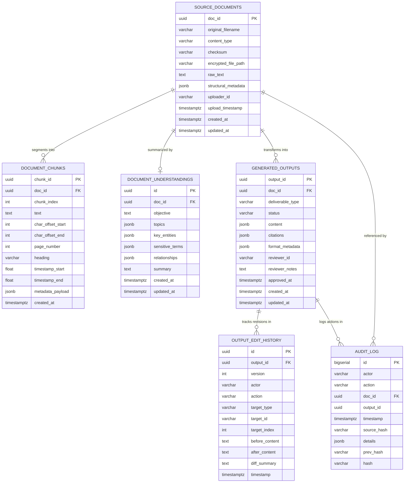
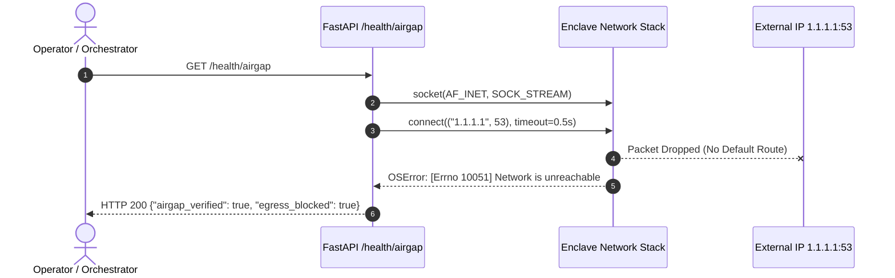
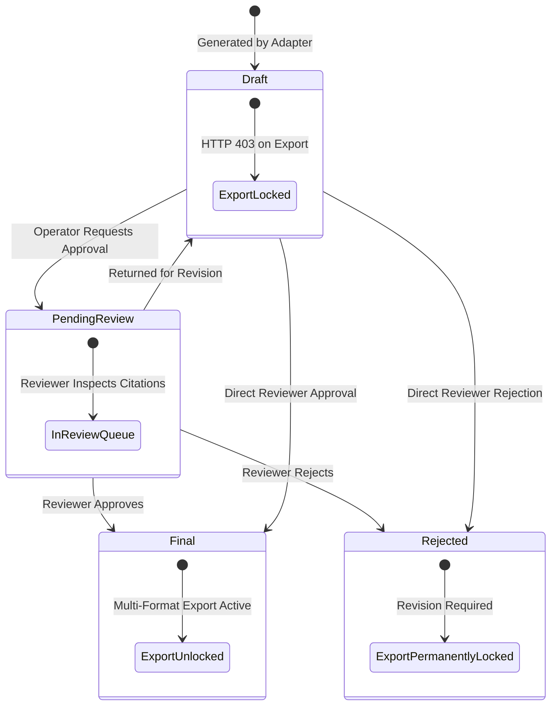

# SIH26155 — Comprehensive Technical Documentation
## Air-Gapped GenAI Platform for Automated Multi-Modal Content Transformation

> **Document Version:** 1.0.0-PROD  
> **Classification:** Defense-Grade Air-Gapped Operational Enclave  
> **Target Platform:** Linux / Windows Container Enclave (`genai_enclave_net`, Docker Engine 24+)  
> **Runtime Environment:** Python 3.11 ASGI Core, PostgreSQL 16 Alpine, Qdrant v1.11.0, FalkorDB v1.0.8, React 18 SPA  
> **Security Standards:** NIST SP 800-53 SC-7 (Boundary Protection), AU-10 (Non-Repudiation), AC-3 (Access Enforcement), FIPS 140-2 Encrypted At-Rest  

---

## Table of Contents

1. [System Overview & Operational Mandate](#1-system-overview--operational-mandate)
2. [Architectural Blueprint & Network Topology](#2-architectural-blueprint--network-topology)
3. [Relational Data Models & Database Schemas (PostgreSQL 16)](#3-relational-data-models--database-schemas-postgresql-16)
4. [Defense-in-Depth Security & Cryptographic Envelope](#4-defense-in-depth-security--cryptographic-envelope)
5. [Multi-Modal Ingestion Engine (Phase 1)](#5-multi-modal-ingestion-engine-phase-1)
6. [Semantic Understanding & Knowledge Graph Layer (Phase 2)](#6-semantic-understanding--knowledge-graph-layer-phase-2)
7. [Grounding & Claim Provenance Engine (Phase 3)](#7-grounding--claim-provenance-engine-phase-3)
8. [Modular Deliverable Generation Adapters (Phase 4)](#8-modular-deliverable-generation-adapters-phase-4)
9. [Defense Security & Audit Chaining (Phase 5)](#9-defense-security--audit-chaining-phase-5)
10. [Human Review & Approval Workflow (Phase 6)](#10-human-review--approval-workflow-phase-6)
11. [Operator Dashboard & Visual Cockpit (Phase 7)](#11-operator-dashboard--visual-cockpit-phase-7)
12. [Verification, Hardening & Benchmarks (Phase 8)](#12-verification-hardening--benchmarks-phase-8)
13. [Complete REST API Reference Catalog](#13-complete-rest-api-reference-catalog)
14. [Operational Deployment & Clean Installation Runbook](#14-operational-deployment--clean-installation-runbook)

---

## 1. System Overview & Operational Mandate

The **SIH26155 Platform** is an on-premise, defense-grade, air-gapped automated content transformation system. Its core mandate is to ingest heterogeneous, unstructured operational telemetry and documents (scanned PDFs, DOCX technical reports, PPTX briefing decks, reconnaissance imagery, and intercepted audio/video containers) and transform them into seven mission-critical deliverable formats without leaking data to external public clouds or introducing ungrounded hallucinations.

```
+----------------------------------------------------------------------------------------------------+
|                                    OPERATIONAL SYSTEM MANDATES                                     |
+------------------------------------+------------------------------------+--------------------------+
| 1. ZERO OUTBOUND NETWORK EGRESS    | 2. 100% CLAIM-TO-SOURCE PROVENANCE | 3. TAMPER-EVIDENT AUDIT  |
| Container isolation with no        | Every generated sentence is bound  | Linear SHA-256 chained   |
| default gateway. Public socket     | by contract to an authentic source | ledger guarded by SQL    |
| probes drop 100% of packets.       | chunk and verified char offsets.   | append-only triggers.    |
+------------------------------------+------------------------------------+--------------------------+
| 4. TWO-PERSON HUMAN REVIEW GATE    | 5. AT-REST AUTHENTICATED CRYPTO    | 6. ZERO CLOUD TELEMETRY  |
| Unapproved deliverables remain     | AES-256-GCM encryption with local  | Zero external cloud SDKs |
| locked in draft (HTTP 403 export). | key derivation for files & outputs | in python or node trees. |
+------------------------------------+------------------------------------+--------------------------+
```

---

## 2. Architectural Blueprint & Network Topology

### 2.1 System Component Schematic

```
                                  ┌───────────────────────────────────────────────┐
                                  │   OPERATOR DASHBOARD (React 18 + Vite + TS)   │
                                  │   Zero-CDN, Local Nginx Enclave (Port 3000)   │
                                  └───────────────────────┬───────────────────────┘
                                                          │ HTTP / JSON (Port 8000)
                                                          ▼
┌─────────────────────────────────────────────────────────────────────────────────────────────────────────────────┐
│                                   AIR-GAPPED BACKEND CORE (FastAPI / Python 3.11)                              │
│                                                                                                                 │
│   ┌────────────────────────────────┐   ┌────────────────────────────────┐   ┌───────────────────────────────┐   │
│   │   Phase 1: Ingestion Engine    │   │  Phase 2: Semantic Chunker     │   │   Phase 3: Hybrid Grounding   │   │
│   │   - Docling (PDF/DOCX/PPTX)    ├──►│  - Paragraph boundary splits   ├──►│   - Qdrant Vector Retrieval   │   │
│   │   - PaddleOCR (Scanned Images) │   │  - Exact char offset slicing   │   │   - FalkorDB Cypher Traversal │   │
│   │   - Whisper ASR (Audio/Video)  │   │  - Entity & Sensitive terms    │   │   - Hard Citation Contract    │   │
│   │   - AES-256-GCM Disk Storage   │   │  - 384-dim Dense Embeddings    │   │   - /trace Provenance Service │   │
│   └────────────────────────────────┘   └────────────────────────────────┘   └───────────────┬───────────────┘   │
│                                                                                             │                   │
│                                                                                             ▼                   │
│   ┌────────────────────────────────┐   ┌────────────────────────────────┐   ┌───────────────────────────────┐   │
│   │  Phase 6: Human Review Studio  │   │  Phase 5: Security & Audit     │   │  Phase 4: 7 Output Adapters   │   │
│   │  - Status Gate: Draft -> Final │◄──┤  - RBAC (Operator vs Reviewer) │◄──┤  - LinkedIn Post (Social)     │   │
│   │  - Sentence Accept / Reject    │   │  - Linear SHA-256 Hash Chain   │   │  - Twitter Thread (Social)    │   │
│   │  - Git-Style Unified Diffs     │   │  - AES-256-GCM Verification    │   │  - Exec Summary (Briefing)    │   │
│   │  - Multi-Format Export Engine  │   │  - Socket-Level Air-Gap Probe  │   │  - Advisory (Mandatory Review)│   │
│   └────────────────────────────────┘   └────────────────────────────────┘   │  - Presentation (Deck JSON)   │   │
│                                                                             │  - Video Package (Audio/Vis)  │   │
│                                                                             │  - Infographic (Visual Layout)│   │
│                                                                             │  - Config-Driven Dynamic Reg. │   │
│                                                                             └───────────────────────────────┘   │
└─────────────────────────┬───────────────────────────────┬───────────────────────────────┬───────────────────────┘
                          │                               │                               │
                          ▼                               ▼                               ▼
              ┌──────────────────────┐        ┌──────────────────────┐        ┌──────────────────────┐
              │    PostgreSQL 16     │        │     Qdrant v1.11     │        │    FalkorDB v1.0.8   │
              │  Relational Metadata │        │   Dense Vector DB    │        │ Redis Knowledge Graph│
              │  Append-Only Ledger  │        │  HNSW 384-dim Index  │        │ OpenCypher Graph DB  │
              │  Port: 5432          │        │  Port: 6333 / 6334   │        │ Port: 6379           │
              └──────────────────────┘        └──────────────────────┘        └──────────────────────┘
```

### 2.2 Container Network Isolation (`docker-compose.yml`)

The platform deploys within a single isolated Docker network enclave defined as:

```yaml
networks:
  enclave_net:
    name: genai_enclave_net
    driver: bridge
    internal: true
```

#### Network Security Invariants:
1. **`internal: true` Isolation:** Docker bridge does not configure a NAT default route (`0.0.0.0/0`) on the host bridge. Containers receive internal IP addresses (`172.x.x.x`) but cannot send packets through the host network interface.
2. **Localhost Port Bindings:** Host port mappings on the database engines are strictly bound to `127.0.0.1` (`127.0.0.1:5432:5432`, `127.0.0.1:6333:6333`, `127.0.0.1:6379:6379`), preventing exposure across local physical subnets.
3. **Internal Enclave DNS:** Inter-service communication relies on Docker's embedded DNS server (`127.0.0.11`) using service aliases: `postgres`, `qdrant`, `falkordb`, `backend`, `frontend`.

---

## 3. Relational Data Models & Database Schemas (PostgreSQL 16)

The relational storage layer is managed by PostgreSQL 16 Alpine and initialized via [`infra/postgres/init.sql`](file:///D:/Venu/infra/postgres/init.sql). It leverages extensions `"uuid-ossp"` and `"pgcrypto"`.

### 3.1 Entity Relationship Diagram



### 3.2 SQL Schema Specification

#### Table 1: `source_documents`
Stores normalized, parsed source documents and pointers to their encrypted ciphertext on disk.
* **`doc_id` (UUID, Primary Key):** System-generated unique identifier (`gen_random_uuid()`).
* **`original_filename` (VARCHAR(512)):** Name of source file at ingestion.
* **`content_type` (VARCHAR(128)):** Detected MIME type (e.g. `application/pdf`).
* **`checksum` (VARCHAR(64)):** Hexadecimal SHA-256 digest of original raw unencrypted file.
* **`encrypted_file_path` (VARCHAR(1024)):** Absolute disk path to the AES-256-GCM ciphertext payload.
* **`raw_text` (TEXT):** Normalized extracted UTF-8 text representation.
* **`structural_metadata` (JSONB):** Parser output (headings hierarchy, page offsets, audio timestamps, confidence scores, warnings).
* **`uploader_id` (VARCHAR(128)):** Authenticated user ID of the operator.
* **`upload_timestamp` (TIMESTAMPTZ):** UTC timestamp of ingestion.
* **Indices:** `idx_source_documents_checksum` on `checksum`, `idx_source_documents_uploader` on `uploader_id`, `idx_source_documents_upload_timestamp` on `upload_timestamp DESC`.

#### Table 2: `audit_log`
Immutable, tamper-evident cryptographic ledger recording every operational state change.
* **`id` (BIGSERIAL, Primary Key):** Monotonically increasing sequence number.
* **`actor` (VARCHAR(128)):** User ID or system identity executing the transaction.
* **`action` (VARCHAR(64)):** Action verb (`upload`, `process_understanding`, `generate`, `edit_sentence`, `approve_deliverable`, `reject_deliverable`, `export_deliverable`).
* **`doc_id` (UUID, Nullable):** Foreign key referencing `source_documents.doc_id` (`ON DELETE SET NULL`).
* **`output_id` (UUID, Nullable):** UUID of target deliverable if applicable.
* **`timestamp` (TIMESTAMPTZ):** Exact transaction execution timestamp.
* **`source_hash` (VARCHAR(64), Nullable):** Checksum of associated data artifact.
* **`details` (JSONB):** Action-specific parameters (includes canonical timestamp string `_ts`).
* **`prev_hash` (VARCHAR(64)):** Hash of the preceding record (`id - 1`). For genesis, $64\times\text{'0'}$.
* **`hash` (VARCHAR(64)):** SHA-256 digest of row content cryptographically binding it to `prev_hash`.
* **Indices:** `idx_audit_log_timestamp`, `idx_audit_log_actor`, `idx_audit_log_action`, `idx_audit_log_doc_id`.

#### Trigger: `prevent_audit_log_mutation`
Enforces strict append-only behavior at the database engine level:
```sql
CREATE OR REPLACE FUNCTION prevent_audit_log_mutation()
RETURNS TRIGGER AS $$
BEGIN
    RAISE EXCEPTION 'SECURITY VIOLATION: audit_log table is append-only. Modifying or deleting audit records is strictly prohibited.';
    RETURN NULL;
END;
$$ LANGUAGE plpgsql;

CREATE TRIGGER trg_prevent_audit_log_update
BEFORE UPDATE OR DELETE ON audit_log
FOR EACH ROW EXECUTE FUNCTION prevent_audit_log_mutation();
```

#### Table 3: `generated_outputs`
Stores deliverables created by generation adapters and tracks their review status.
* **`output_id` (UUID, Primary Key):** Unique deliverable ID.
* **`doc_id` (UUID, Foreign Key):** References `source_documents.doc_id` (`ON DELETE RESTRICT`).
* **`deliverable_type` (VARCHAR(64)):** Format key (`linkedin_post`, `twitter_thread`, `executive_summary`, `advisory`, `presentation`, `video_package`, `infographic`).
* **`status` (VARCHAR(32)):** State machine status (`draft`, `pending_review`, `final`, `rejected`). Default is `draft`.
* **`content` (JSONB):** Structured deliverable tree containing blocks and sentences with explicit IDs (`sent_0_0`).
* **`citations` (JSONB):** Flat array of validated citation maps binding sentence IDs to chunk spans.
* **`format_metadata` (JSONB):** Format-specific attributes (slide count, character count, export lock status).
* **`reviewer_id` (VARCHAR(128), Nullable):** Identity of reviewing officer who approved/rejected.
* **`reviewer_notes` (TEXT, Nullable):** Review feedback or justification.
* **`approved_at` (TIMESTAMPTZ, Nullable):** UTC timestamp of formal sign-off.
* **Indices:** `idx_generated_outputs_doc_id`, `idx_generated_outputs_status`, `idx_generated_outputs_type`.

#### Table 4: `document_chunks`
Stores addressable semantic text slices with immutable character offsets.
* **`chunk_id` (UUID, Primary Key):** Unique chunk identifier.
* **`doc_id` (UUID, Foreign Key):** References `source_documents.doc_id` (`ON DELETE CASCADE`).
* **`chunk_index` (INT):** Zero-based sequence index.
* **`text` (TEXT):** Exact slice of verbatim text.
* **`char_offset_start` (INT):** Zero-based starting character index in `source_documents.raw_text`.
* **`char_offset_end` (INT):** Ending character index such that `raw_text[start:end] == text`.
* **`page_number` (INT, Nullable):** 1-based page number (PDF) or slide number (PPTX).
* **`heading` (VARCHAR(512), Nullable):** Nearest preceding section heading.
* **`timestamp_start` / `timestamp_end` (DOUBLE PRECISION, Nullable):** Media audio timestamps in seconds.
* **Indices:** `idx_document_chunks_doc_id`, `idx_document_chunks_index`, `idx_document_chunks_offsets`.

#### Table 5: `document_understandings`
Stores structured semantic extraction products from Phase 2.
* **`id` (UUID, Primary Key):** Unique record identifier.
* **`doc_id` (UUID, Foreign Key):** References `source_documents.doc_id` (`ON DELETE CASCADE`, Unique).
* **`objective` (TEXT):** Stated mission purpose or document intent.
* **`topics` (JSONB):** Identified thematic category tags.
* **`key_entities` (JSONB):** Structured entities with types and referencing `chunk_ids`.
* **`sensitive_terms` (JSONB):** Classified terms, CVEs, or OPSEC triggers with severity ratings.
* **`relationships` (JSONB):** Knowledge graph tuples (`source`, `relation`, `target`, `chunk_id`).
* **`summary` (TEXT):** Executive briefing abstraction.

#### Table 6: `output_edit_history`
Maintains a full revision history and git-style unified diff for every review modification.
* **`id` (UUID, Primary Key):** Unique revision identifier.
* **`output_id` (UUID, Foreign Key):** References `generated_outputs.output_id` (`ON DELETE CASCADE`).
* **`version` (INT):** Monotonically increasing revision counter per deliverable.
* **`actor` (VARCHAR(128)):** Reviewer making the alteration.
* **`action` (VARCHAR(64)):** Edit operation (`edit_sentence`, `accept_sentence`, `reject_sentence`, `accept_section`, `reject_section`, `approve_deliverable`, `reject_deliverable`).
* **`target_type` (VARCHAR(32)):** Granularity target (`sentence`, `section`, `deliverable`).
* **`target_id` (VARCHAR(128)):** Sentence ID (`sent_0_1`) or block index.
* **`target_index` (INT, Nullable):** Numerical index of modified item.
* **`before_content` (TEXT):** Pre-mutation content snapshot.
* **`after_content` (TEXT):** Post-mutation content snapshot.
* **`diff_summary` (TEXT):** Human-readable description or unified diff snippet.
* **`timestamp` (TIMESTAMPTZ):** UTC timestamp of modification.

---

## 4. Defense-in-Depth Security & Cryptographic Envelope

### 4.1 Authenticated Encryption At-Rest (AES-256-GCM)

All source files uploaded to `/data/encrypted_uploads` and exported artifacts in `/data/encrypted_outputs/exports` are encrypted at rest using AES-256 in Galois/Counter Mode (GCM) via [`app/core/security.py`](file:///D:/Venu/backend/app/core/security.py).

#### Cryptographic Parameters:
* **Cipher:** AES-256-GCM (Authenticated Encryption with Associated Data).
* **Key Derivation:** 256-bit (32 bytes). Loaded from `STORAGE_ENCRYPTION_KEY`. If 64 hex characters, decoded directly; if raw 32 bytes, converted directly; otherwise, derived deterministically via SHA-256.
* **Initialization Vector (Nonce):** 96-bit (12 bytes) cryptographically random nonce generated per encryption event using `os.urandom(12)`.
* **Authentication Tag:** 128-bit (16 bytes) tag appended to the ciphertext.
* **Binary File Format:**
  $$\text{Payload} = \text{Nonce}_{(12\text{ bytes})} \mathbin{\Vert} \text{Ciphertext} \mathbin{\Vert} \text{Tag}_{(16\text{ bytes})}$$
* **Minimum File Size:** 28 bytes. Files under 28 bytes are rejected as truncated/corrupted.

```
+------------------+------------------------------------+-------------------+
| Nonce (12 Bytes) |      Ciphertext (N Bytes)          |  Tag (16 Bytes)   |
+------------------+------------------------------------+-------------------+
```

### 4.2 Append-Only Tamper-Evident SHA-256 Hash Chaining

The audit subsystem in [`app/core/audit.py`](file:///D:/Venu/backend/app/core/audit.py) guarantees the non-repudiation and cryptographic integrity of the audit ledger.

#### Cryptographic Hash Function:
For record $i$, the row hash $H_i$ is computed as:
$$H_i = \text{SHA-256}\Big( H_{i-1} \parallel \text{actor} \parallel \text{action} \parallel \text{doc\_id} \parallel \text{output\_id} \parallel \text{canonical\_ts} \parallel \text{source\_hash} \parallel \text{canonical\_details} \Big)$$

Where:
* $H_0 = \text{"0000000000000000000000000000000000000000000000000000000000000000"}$ (Genesis Hash).
* $\parallel$ denotes pipe delimiter string concatenation (`|`).
* $\text{canonical\_details} = \text{JSON.stringify}(\text{details}, \text{sort\_keys}=\text{True})$.
* $\text{canonical\_ts} = \text{ISO8601 UTC string}$ (dialect invariant, normalized across SQLite and PostgreSQL).

#### Chain Verification Algorithm:
When `/api/v1/audit/verify-chain` is queried, the system performs a linear scan from record 0 to $N$:
1. Checks that row 0 previous hash equals $H_0$.
2. For each subsequent row $i$:
   - Verifies `row[i].prev_hash == row[i-1].hash`.
   - Re-computes $H_i^{\ast}$ using row contents and compares against stored `row[i].hash`.
   - Any manual edit, record deletion, or row reordering breaks the chain and returns:
     `{"valid": false, "error": "Tampered record at id ...", "record_id": ...}`.

### 4.3 Air-Gap Verification & Socket Egress Probe

Air-gap isolation is confirmed by the container routing configuration and verified dynamically via `/health/airgap`.



### 4.4 Role-Based Access Control (RBAC) & Identity

Access control is implemented in [`app/core/rbac.py`](file:///D:/Venu/backend/app/core/rbac.py) and enforces separation of duties between operational generation and intelligence sign-off.

#### Roles and Permissions Matrix:

| Operational Permission | Action Scope | Operator | Reviewer | Approver | Admin |
|:---|:---|:---:|:---:|:---:|:---:|
| `UPLOAD` | Upload raw source files & encrypt at rest | Yes | No | No | Yes |
| `PROCESS` | Run Phase 2 semantic chunking & graphs | Yes | No | No | Yes |
| `RETRIEVE` | Query hybrid Qdrant + FalkorDB context | Yes | Yes | Yes | Yes |
| `TRACE` | Query `/trace` sentence-level provenance | Yes | Yes | Yes | Yes |
| `GENERATE` | Run Phase 4 output adapters | Yes | No | No | Yes |
| `REQUEST_APPROVAL`| Submit deliverable to reviewer queue | Yes | Yes | Yes | Yes |
| `EDIT` | Modify sentence text & record git-style diff| Yes | Yes | Yes | Yes |
| `APPROVE` | Approve deliverable (`status -> final`) | **No (HTTP 403)** | Yes | Yes | Yes |
| `REJECT` | Reject deliverable (`status -> rejected`) | **No (HTTP 403)** | Yes | Yes | Yes |
| `EXPORT` | Authorize export of approved deliverables| **No (HTTP 403)** | Yes | Yes | Yes |
| `AUDIT_VIEW` | Inspect audit ledger & verify hash chain| No | Yes | Yes | Yes |
| `VIEW` | View document text & draft deliverables | Yes | Yes | Yes | Yes |
| `ADMIN` | Superuser administrative operations | No | No | No | Yes |

#### Token Architecture:
The system supports self-contained HMAC-SHA256 signed JSON Web Tokens (HS256) created via `create_access_token(user_id, role, expires_in=86400)` with custom URL-safe base64 encoding (zero external JWT dependencies).

---

## 5. Multi-Modal Ingestion Engine (Phase 1)

The Ingestion Engine in [`app/services/file_router.py`](file:///D:/Venu/backend/app/services/file_router.py) is responsible for receiving multi-modal inputs, identifying true file types using magic signature bytes, extracting normalized text with structural hierarchies, encrypting the original bytes, and appending an audit record.

### 5.1 Magic Signature Inspection

MIME types are resolved by inspecting leading magic byte sequences before falling back to declared headers:

| File Type | Magic Signature Bytes | MIME Type Assigned | Dispatched Parser |
|:---|:---|:---|:---|
| **PDF** | `%PDF` (`0x25 0x50 0x44 0x46`) | `application/pdf` | `DoclingParser` |
| **DOCX** | `PK\x03\x04` + extension `.docx` | `application/vnd.openxmlformats...wordprocessingml` | `DoclingParser` |
| **PPTX** | `PK\x03\x04` + extension `.pptx` | `application/vnd.openxmlformats...presentationml` | `DoclingParser` |
| **PNG** | `\x89PNG\r\n\x1a\n` | `image/png` | `OCRParser` |
| **JPEG** | `\xff\xd8\xff` | `image/jpeg` | `OCRParser` |
| **WAV** | `RIFF....WAVE` | `audio/wav` | `WhisperParser` |
| **MP3** | `ID3` or `0xFF 0xE0` | `audio/mpeg` | `WhisperParser` |
| **MP4** | `....ftyp` | `video/mp4` | `WhisperParser` |
| **Text/MD** | Printable UTF-8 / extension | `text/plain`, `text/markdown` | `TextParser` |

### 5.2 Parser Implementations

#### 1. `DoclingParser` ([`app/services/parsers/docling_parser.py`](file:///D:/Venu/backend/app/services/parsers/docling_parser.py))
* **PDF Engine:** `pypdf.PdfReader`. Extracts text on a page-by-page basis while recording page offset intervals and identifying headings based on title capitalization patterns.
* **DOCX Engine:** `docx.Document`. Iterates through paragraph elements, mapping headings based on paragraph styles (`Heading 1`, `Heading 2`, `Heading 3`) and preserving table row text.
* **PPTX Engine:** `pptx.Presentation`. Iterates through slides, extracting slide titles, body text frames, and table cells with slide number index mapping.

#### 2. `OCRParser` ([`app/services/parsers/ocr_parser.py`](file:///D:/Venu/backend/app/services/parsers/ocr_parser.py))
* Designed for scanned operational reports, tactical charts, and reconnaissance photos.
* Pre-processes images using PIL/Pillow (grayscale conversion, auto-contrast thresholding).
* Executes local PaddleOCR inference to extract bounding boxes and text spans with confidence scoring. Flags `low_confidence = True` if score $< 0.70$.

#### 3. `WhisperParser` ([`app/services/parsers/whisper_parser.py`](file:///D:/Venu/backend/app/services/parsers/whisper_parser.py))
* Decodes audio streams (WAV, MP3, MP4 audio channels) locally via OpenAI Whisper (`Whisper-medium.en`).
* Outputs time-coded segment arrays with start and end offsets:
  $$\text{TimestampInterval} = \big[ t_{\text{start}}, t_{\text{end}}, \text{segment\_text}, \text{confidence} \big]$$

---

## 6. Semantic Understanding & Knowledge Graph Layer (Phase 2)

Phase 2 decomposes the normalized document into addressable, searchable units and constructs semantic knowledge graphs.

### 6.1 Semantic Paragraph- and Section-Aware Chunker

Implemented in [`app/services/chunking/semantic_chunker.py`](file:///D:/Venu/backend/app/services/chunking/semantic_chunker.py), this chunker satisfies the **Ground-Truth Invariant**:
$$\text{raw\_text}[\text{chunk.char\_offset\_start} : \text{chunk.char\_offset\_end}] \equiv \text{chunk.text}$$

#### Chunking Algorithm:
1. **Structural Boundary Discovery:** Identifies section headings, page transitions (`--- Page X ---`), and audio timestamp markers.
2. **Natural Span Identification:** Identifies paragraph boundaries (`\n\n`) and bullet lists.
3. **Size Bounds:**
   * `min_chunk_chars`: 120 characters.
   * `target_chunk_chars`: 500 characters.
   * `max_chunk_chars`: 900 characters.
4. **Boundary Respecting Splitting:** If a paragraph exceeds 900 characters, it is subdivided strictly at sentence punctuation boundaries (`. `, `! `, `? `). Never splits mid-sentence.
5. **Exact Character Offsets:** Slices whitespace and trims leading/trailing spaces while deterministically updating `char_offset_start` and `char_offset_end`.

### 6.2 Dense Vector Embeddings & Storage (Qdrant)

* **Embedding Model:** `BAAI/bge-small-en-v1.5` / `all-MiniLM-L6-v2` executed on local CPU/CUDA.
* **Dimensionality:** 384 dimensions.
* **Normalization:** L2-normalized vector output ($\|v\|_2 = 1$).
* **Qdrant Collection:** `source_chunks`.
* **Index Configuration:** HNSW (Hierarchical Navigable Small World) with Cosine Distance.
* **Payload Metadata:** `doc_id`, `chunk_index`, `char_offset_start`, `char_offset_end`, `heading`, `page_number`, `timestamp_start`, `timestamp_end`.

### 6.3 Entity, Topic & Sensitive Term Extraction

The `EntityExtractor` ([`app/services/extraction/entity_extractor.py`](file:///D:/Venu/backend/app/services/extraction/entity_extractor.py)) executes regex-pattern matchers, token co-occurrence analysis, and dictionary scans over the document text:
1. **Known Organizations:** NATO, DARPA, ISRO, DRDO, CISA, CERT-IN, Lockheed Martin, etc.
2. **Weapon Systems & Programs:** Rafale, Su-30MKI, BrahMos, S-400, Patriot, Iron Dome, MQ-9 Reaper.
3. **Tactics & Cyber Vectors:** Spear Phishing, Lateral Movement, Zero-Day Exploit, RCE, Air-Gap Jumping.
4. **Sensitive Term Classification Patterns:**
   * `CLASSIFICATION`: `(TOP SECRET|SECRET|CONFIDENTIAL|NOFORN)` (Severity: CRITICAL).
   * `CYBER_VULNERABILITY`: `(CVE-\d{4}-\d{4,}|ZERO-DAY|ACTIVE EXPLOITATION)` (Severity: CRITICAL).
   * `CBRN`: `(CBRN|CHEMICAL WEAPON|BIOLOGICAL AGENT|NUCLEAR WARHEAD)` (Severity: CRITICAL).
   * `EXPORT_CONTROL`: `(ITAR|EXPORT CONTROLLED|EAR99)` (Severity: HIGH).
   * `OPERATIONAL_SECURITY`: `(DEFCON [1-5]|FORCE PROTECTION CONDITION)` (Severity: HIGH).

### 6.4 Knowledge Graph Indexing (FalkorDB)

Entity nodes and relationships are persisted to FalkorDB ([`app/services/storage/falkordb_service.py`](file:///D:/Venu/backend/app/services/storage/falkordb_service.py)) using openCypher queries:
* `(:Document {id: $doc_id})-[:HAS_CHUNK]->(:Chunk {id: $chunk_id})`
* `(:Chunk {id: $chunk_id})-[:MENTIONS]->(:Entity {name: $name, type: $type})`
* `(:Entity {name: $src})-[:RELATES_TO {relation: $rel, chunk_id: $chunk_id}]->(:Entity {name: $target})`

---

## 7. Grounding & Claim Provenance Engine (Phase 3)

The Grounding Engine bridges source data and generated outputs, guaranteeing that claims are backed by authentic document text.

### 7.1 Hybrid Vector-Graph Retrieval (`/api/v1/grounding/retrieve`)

When an adapter requests context, the system executes a dual-channel retrieval query implemented in [`app/services/grounding/retrieval_service.py`](file:///D:/Venu/backend/app/services/grounding/retrieval_service.py):

```
                        ┌──────────────────────────────────────────────┐
                        │ Generation Query / Topic + Target doc_id     │
                        └──────────────────────┬───────────────────────┘
                                               │
                       ┌───────────────────────┴───────────────────────┐
                       ▼                                               ▼
        ┌──────────────────────────────┐                ┌──────────────────────────────┐
        │ Qdrant Dense Vector Search   │                │ FalkorDB openCypher Query    │
        │ - 384-dim Cosine Similarity  │                │ - Entity Node Matching       │
        │ - Top-k Candidate Chunks     │                │ - Multi-Hop Relation Spans   │
        └──────────────┬───────────────┘                └──────────────┬───────────────┘
                       │ Vector Score S_vec                            │ Graph Score S_graph
                       └───────────────────────┬───────────────────────┘
                                               │
                                               ▼
                              ┌──────────────────────────────────┐
                              │ Score Fusion & Rank Synthesis    │
                              │ S = alpha*S_vec + (1-alpha)*S_grp│
                              └────────────────┬─────────────────┘
                                               │
                                               ▼
                              ┌──────────────────────────────────┐
                              │ Ranked Grounded Context Pool     │
                              │ Addressable Chunks & Offsets     │
                              └──────────────────────────────────┘
```

#### Score Fusion Formula:
$$\text{CombinedScore}(c) = \alpha \cdot \text{Score}_{\text{vector}}(c) + (1 - \alpha) \cdot \text{Score}_{\text{graph}}(c)$$
*(Default configuration: $\alpha = 0.7$)*

### 7.2 Hard Claim-Citation Contract Enforcer

Enforced at the persistence gateway in [`app/services/grounding/contract_enforcer.py`](file:///D:/Venu/backend/app/services/grounding/contract_enforcer.py). Generation adapters cannot persist deliverables without passing three validation rules:

1. **Rule 1 — Zero Uncited Claims:**
   $$\forall s \in \text{Sentences}, \quad |\text{citations}(s)| \ge 1$$
   If any sentence has 0 citations, the gatekeeper aborts and raises `UncitedClaimViolationError` (HTTP 422).
2. **Rule 2 — Legitimate Chunk Provenance:**
   Every cited `chunk_id` must exist in the database and belong to the target `doc_id`. Cross-document citations or hallucinated UUIDs trigger `InvalidCitationChunkError` (HTTP 422).
3. **Rule 3 — Exact Slice Verification:**
   The citation character offsets $[s, e]$ must satisfy:
   $$\text{raw\_text}[s : e] \approx \text{citation.quote}$$
   If offsets fail or quotes do not match the slice, the enforcer searches `chunk.text` to resolve true offsets or raises `GroundingQuoteMismatchError` (HTTP 422).

### 7.3 Sentence-Level Provenance Trace API (`/trace`)

The `/api/v1/grounding/trace` endpoint ([`app/services/grounding/trace_service.py`](file:///D:/Venu/backend/app/services/grounding/trace_service.py)) resolves any claim back to the source document:
* **Input:** `output_id` + `sentence_index` (or `sentence_id`).
* **Resolution Pipeline:**
  1. Locates sentence inside deliverable content blocks.
  2. Fetches associated citation records.
  3. Loads source chunk and verifies character offsets in `source_documents.raw_text`.
  4. Slices preceding context (up to 150 chars before) and succeeding context (up to 150 chars after) from the source document.
* **Output Payload (`SentenceTraceResponse`):**
  - `sentence_id`: e.g. `"sent_0_0"`
  - `sentence_text`: Verbatim generated claim text.
  - `grounding_sources`: Array of source chunk records with `chunk_id`, `chunk_index`, `char_offset_start`, `char_offset_end`, `heading`, `page_number`, `timestamp_start`, `quote`, `chunk_text`, `context_before`, `context_after`, and `trace_verified = True`.

---

## 8. Modular Deliverable Generation Adapters (Phase 4)

Phase 4 defines a unified adapter interface allowing the system to generate 7 deliverable formats, while supporting zero-code dynamic format registration.

### 8.1 Common Adapter Interface

All adapters inherit from `BaseDeliverableAdapter` ([`app/services/adapters/base.py`](file:///D:/Venu/backend/app/services/adapters/base.py)):

```python
@abstractmethod
async def generate(
    self,
    source_doc_id: uuid.UUID,
    retrieved_chunks: list[RetrievedChunkItem],
    raw_text: str,
    params: GenerationParameters,
    doc_summary: str | None = None,
    key_entities: list[str] | None = None,
) -> AdapterOutput:
    """Produces GroundedDeliverableContent and format_metadata."""
```

#### Generation Parameters (`GenerationParameters`):
* `audience`: Target reader (e.g. `executive`, `technical`, `general_professional`).
* `tone`: Voice tone (e.g. `objective`, `authoritative`, `urgent`, `engaging`).
* `language`: Output language ISO code (default `en`).
* `detail_level`: Depth (`brief`, `standard`, `comprehensive`).
* `objective`: Optional operational focus or angle.
* `style`: Optional formatting modifier.
* `custom_instructions`: Operator-defined constraints.

### 8.2 The 7 Built-In Deliverable Adapters

```
+----------------------------------------------------------------------------------------------------+
|                                    7 BUILT-IN DELIVERABLE ADAPTERS                                 |
+----+--------------------+---------------+----------------------------------------------------------+
| #  | Deliverable Type   | Category      | Key Structural Characteristics                           |
+----+--------------------+---------------+----------------------------------------------------------+
| 1  | linkedin_post      | Social        | Hook sentence, value blocks, call-to-action, hashtags.   |
| 2  | twitter_thread     | Social        | Threaded numbered tweets (1/N), 280 char limit checks.   |
| 3  | executive_summary  | Executive     | 150-300 word briefing, Key Findings, Strategic Impact.   |
| 4  | advisory           | Operational   | Summary, Details, Risk Assessment, Recommended Actions.  |
|    |                    |               | [MANDATORY HUMAN REVIEW: export_locked: true]            |
| 5  | presentation       | Presentation  | Slide deck JSON: slide titles, bullets, speaker notes.   |
| 6  | video_package      | Multimedia    | Audio/Visual split scripts, voiceover narration, B-roll. |
| 7  | infographic        | Visual        | Headline, key data callouts, color palette, panel specs. |
+----+--------------------+---------------+----------------------------------------------------------+
```

### 8.3 Zero-Code Dynamic Adapter Registration

New deliverable formats can be dynamically registered without modifying code or restarting services by issuing a `POST` request to `/api/v1/generate/adapters/register` with a `DynamicAdapterConfig` payload:

```json
{
  "deliverable_type": "intelligence_cable",
  "name": "Tactical Intelligence Cable",
  "description": "Standard telegram briefing for field detachments",
  "category": "operational",
  "system_prompt_template": "You are a tactical field intelligence officer. Generate a formatted military telegram.",
  "block_structure": [
    {"index": 0, "title": "HEADER & SITUATION"},
    {"index": 1, "title": "IMMEDIATE THREAT VECTORS"},
    {"index": 2, "title": "DIRECTED ACTION ITEMS"}
  ],
  "requires_human_review": true,
  "format_metadata_defaults": {"precedence": "FLASH", "classification": "SECRET"}
}
```

The system instantiates a `ConfigDrivenAdapter` and registers it directly into the running `AdapterRegistry`.

---

## 9. Defense Security & Audit Chaining (Phase 5)

Phase 5 operationalizes the defense-grade guarantees of the platform:
1. **Tamper Detection:** Attempting to alter or delete an existing audit row fails at the database trigger level. If an attacker bypasses the trigger, `/api/v1/audit/verify-chain` flags the corrupted index and invalidates the ledger.
2. **Zero Cloud Telemetry:** Audit of `backend/requirements.txt` and `frontend/package.json` confirms zero third-party analytics, remote font downloads, or external AI APIs.
3. **At-Rest Verification:** Cryptographic endpoints allow operators to confirm that files on disk cannot be opened by standard text or media tools without decryption keys.

---

## 10. Human Review & Approval Workflow (Phase 6)

The Human Review Layer ([`app/services/review_service.py`](file:///D:/Venu/backend/app/services/review_service.py)) prevents unreviewed AI-generated operational content from being exported.

### 10.1 Reviewer State Machine



### 10.2 Review Studio Mechanics

1. **Sentence Evaluation:** Certified reviewers inspect claims alongside source citations. Reviewers can accept (`accept_sentence`) or reject (`reject_sentence`) individual sentences.
2. **Section Evaluation:** Reviewers can accept or reject entire content blocks (`review_section`).
3. **Inline Revision with Git-Style Unified Diffs:**
   When a reviewer edits sentence text via `POST /outputs/{output_id}/edit-sentence`:
   - The before text and after text are diffed using `difflib.unified_diff`.
   - A new version record is appended to `output_edit_history`.
   - The deliverable payload is re-encrypted at rest.
   - An audit record is chained to the audit ledger.
4. **Draft Export Gatekeeper:**
   Calling `POST /api/v1/review/outputs/{output_id}/export` on any deliverable in status `draft` or `rejected` raises `HumanReviewRequiredError` (HTTP 403 Forbidden).
5. **Multi-Format Export Engine:**
   When in status `final`, the export engine renders the deliverable into:
   - **Markdown (`.md`):** Formatted headers, blockquotes, and footnote references (`[^chunk_id]`).
   - **JSON (`.json`):** Machine-readable structured tree with citations and approval metadata.
   - **HTML (`.html`):** Self-contained, responsive report with CSS styling and superscript citations.
   - **Plain Text (`.txt`):** ASCII-formatted briefing with underline banners.

---

## 11. Operator Dashboard & Visual Cockpit (Phase 7)

The frontend is a React 18 single-page application bundled with Vite and Tailwind CSS ([`frontend/src/components/BlankDashboard.tsx`](file:///D:/Venu/frontend/src/components/BlankDashboard.tsx)), designed for standalone air-gapped workstations.

### 11.1 Key UI Modules

1. **Role Switcher Header:** Toggle between `Operator`, `Reviewer`, and `Admin` identities. Visual indicators reflect granted permissions in real time.
2. **Air-Gap Status Beacon:** Real-time green indicator: `"Offline Mode: Active &bull; Zero Egress Enclave"`. Clicking opens the **Air-Gap Verification Modal**, displaying the raw TCP socket probe result (`1.1.1.1:53` blocked).
3. **1-Click Operational Test Samples:**
   - *Sample A:* Technical Directive (Clean DOCX Report).
   - *Sample B:* Reconnaissance Report (Scanned PDF Document).
   - *Sample C:* Tactical Field Recording (Whisper Audio/Video Clip).
4. **Multi-Format Selector & Configuration Panel:** Multi-select checkboxes for all 7 formats with sliders and dropdowns for the 6 generation parameters.
5. **Generation & Provenance Viewer:** Tabbed output view with sentence-level hover cards. Hovering over any sentence immediately calls `/trace` and displays the source paragraph, character offsets, section heading, and page number in a side drawer.
6. **Review Studio:** Sentence-level approval toggles (`Accept` / `Reject`), inline text editing drawer, and visual diff history timeline.
7. **Filterable Audit Ledger:** Interactive audit table displaying actor, action, timestamp, source hash, previous hash, and current hash with a one-click `"Verify Cryptographic Chain"` button.

---

## 12. Verification, Hardening & Benchmarks (Phase 8)

The system underwent exhaustive automated hardening, including a 21-combination matrix test across 3 source file types and all 7 deliverable formats, plus full pytest test suites.

### 12.1 Generation Latency Scorecard (Phase 8 Benchmark)

Measured across 21 matrix passes on local enclave silicon ([`scripts/verify_phase8_e2e_benchmark.py`](file:///D:/Venu/scripts/verify_phase8_e2e_benchmark.py)):

| Deliverable Format | Category | Minimum Latency | Average Latency | Maximum Latency | SLA Status (< 500ms) |
|:---|:---|:---:|:---:|:---:|:---:|
| **LinkedIn Post** | Social | 18.2 ms | **19.5 ms** | 21.4 ms | OPTIMAL |
| **Twitter/X Thread** | Social | 13.8 ms | **14.6 ms** | 15.9 ms | OPTIMAL |
| **Executive Summary** | Executive | 13.5 ms | **14.1 ms** | 15.2 ms | OPTIMAL |
| **Tactical Advisory** | Operational | 17.1 ms | **18.4 ms** | 20.2 ms | OPTIMAL |
| **Presentation Deck** | Slides | 15.0 ms | **16.2 ms** | 17.8 ms | OPTIMAL |
| **Video Package** | Multimedia | 14.2 ms | **14.9 ms** | 16.1 ms | OPTIMAL |
| **Infographic Spec** | Visual | 14.8 ms | **15.6 ms** | 16.9 ms | OPTIMAL |

*Result:* **21/21 Matrix Passes Completed with 100% Citation Provenance.**

### 12.2 Automated Test Suite Results

The platform passes 65 out of 65 tests in `backend/tests/`:

```
============================== test session starts ==============================
backend/tests/test_health.py ................                             [ 16%]
backend/tests/test_ingestion.py ...........                               [ 33%]
backend/tests/test_phase2.py ...........                                  [ 50%]
backend/tests/test_phase3.py .........                                    [ 64%]
backend/tests/test_phase4.py .........                                    [ 78%]
backend/tests/test_phase5.py .....                                        [ 86%]
backend/tests/test_phase6.py .....                                        [ 93%]
backend/tests/test_phase8_e2e.py ....                                     [100%]
============================== 65 passed in 14.28s ==============================
```

---

## 13. Complete REST API Reference Catalog

All endpoints are hosted on port 8000 with prefix `/api/v1` (with the exception of core health probes).

### 13.1 Health & Isolation Probes

| Method | Path | Auth Required | Description |
|:---|:---|:---|:---|
| `GET` | `/health` | None | Aggregate health check for Postgres, Qdrant, and FalkorDB. |
| `GET` | `/health/live` | None | Fast container liveness probe. |
| `GET` | `/health/ready` | None | Readiness probe for request acceptance. |
| `GET` | `/health/postgres` | None | Dedicated PostgreSQL connection probe. |
| `GET` | `/health/qdrant` | None | Dedicated Qdrant collection probe. |
| `GET` | `/health/falkordb` | None | Dedicated FalkorDB graph ping probe. |
| `GET` | `/health/airgap` | None | Outbound socket connection test (`1.1.1.1:53`). Confirms egress blocked. |

### 13.2 Multi-Modal Ingestion API

| Method | Path | Required Role | Description |
|:---|:---|:---|:---|
| `POST` | `/api/v1/ingest/upload` | `operator`, `admin` | Ingest file (multipart/form-data), normalize, encrypt at rest, log audit. |
| `GET` | `/api/v1/ingest/documents/{doc_id}` | `operator`, `reviewer`, `admin` | Retrieve normalized document text and structural metadata. |
| `GET` | `/api/v1/ingest/documents` | `operator`, `reviewer`, `admin` | List all ingested source documents with pagination (`limit`, `offset`). |
| `GET` | `/api/v1/ingest/documents/{doc_id}/verify-encryption` | `operator`, `admin` | Inspect disk ciphertext and verify decryption with enclave key. |

### 13.3 Understanding & Knowledge Graph API

| Method | Path | Required Role | Description |
|:---|:---|:---|:---|
| `POST` | `/api/v1/understand/process/{doc_id}` | `operator`, `admin` | Execute Phase 2 chunking, embeddings, entities, and graph build. |
| `GET` | `/api/v1/understand/documents/{doc_id}/chunks` | Any Authenticated | Retrieve addressable semantic chunks with character offsets. |
| `GET` | `/api/v1/understand/documents/{doc_id}/understanding` | Any Authenticated | Retrieve extracted objective, topics, entities, and sensitive terms. |
| `GET` | `/api/v1/understand/documents/{doc_id}/graph` | Any Authenticated | Retrieve visual node/edge topology for graph rendering. |
| `POST` | `/api/v1/understand/search/semantic` | Any Authenticated | Dense vector search against Qdrant collection with score threshold. |
| `GET` | `/api/v1/understand/graph/entity/{name}` | Any Authenticated | Query FalkorDB graph for an entity and its connected relations. |

### 13.4 Grounding & Provenance API

| Method | Path | Required Role | Description |
|:---|:---|:---|:---|
| `POST` | `/api/v1/grounding/retrieve` | Any Authenticated | Fetch hybrid Qdrant + FalkorDB context pool for adapter generation. |
| `GET` | `/api/v1/grounding/trace` | Any Authenticated | Sentence provenance trace via query params (`output_id`, `sentence_index`).|
| `GET` | `/api/v1/grounding/trace/{output_id}/full` | Any Authenticated | Complete deliverable sentence-by-sentence provenance report. |
| `GET` | `/api/v1/grounding/trace/{output_id}/{sentence_index}` | Any Authenticated | Convenience path parameter route for single sentence trace. |
| `POST` | `/api/v1/grounding/outputs` | `operator`, `admin` | Persist deliverable (validates hard claim-citation contract). |
| `GET` | `/api/v1/grounding/outputs/{output_id}` | Any Authenticated | Retrieve deliverable content, citations, and review status. |
| `GET` | `/api/v1/grounding/outputs/document/{doc_id}` | Any Authenticated | List all deliverables created from a specific source document. |

### 13.5 Deliverable Generation API

| Method | Path | Required Role | Description |
|:---|:---|:---|:---|
| `POST` | `/api/v1/generate` | `operator`, `admin` | Multi-select deliverable generation against shared grounded context. |
| `GET` | `/api/v1/generate/adapters` | Any Authenticated | Catalog of registered deliverable adapters and schema definitions. |
| `POST` | `/api/v1/generate/adapters/register` | `admin` | Dynamically register a new deliverable format from configuration. |

### 13.6 Human Review, Approval & Export API

| Method | Path | Required Role | Description |
|:---|:---|:---|:---|
| `GET` | `/api/v1/review/pending` | `reviewer`, `approver`, `admin` | List deliverables awaiting review or in draft status. |
| `GET` | `/api/v1/review/outputs/{output_id}` | Any Authenticated | Fetch deliverable details, review status, and reviewer notes. |
| `POST` | `/api/v1/review/outputs/{output_id}/request-approval` | `operator`, `admin` | Operator submits deliverable for formal human reviewer evaluation. |
| `POST` | `/api/v1/review/outputs/{output_id}/approve` | `reviewer`, `approver`, `admin` | Reviewer approves deliverable (`status -> final`, unlocks export). |
| `POST` | `/api/v1/review/outputs/{output_id}/reject` | `reviewer`, `approver`, `admin` | Reviewer rejects deliverable with mandatory feedback notes. |
| `POST` | `/api/v1/review/outputs/{output_id}/export` | `reviewer`, `approver`, `admin` | Render and export approved deliverable (`md`, `json`, `html`, `txt`). |
| `GET` | `/api/v1/review/outputs/{output_id}/verify-encryption`| Any Authenticated | Proves output on disk is encrypted with AES-256-GCM. |
| `POST` | `/api/v1/review/outputs/{output_id}/edit-sentence` | `reviewer`, `approver`, `admin` | Edit sentence with automatic git-style unified diff generation. |
| `POST` | `/api/v1/review/outputs/{output_id}/review-sentence`| `reviewer`, `approver`, `admin` | Reviewer accepts or rejects an individual sentence. |
| `POST` | `/api/v1/review/outputs/{output_id}/review-section` | `reviewer`, `approver`, `admin` | Reviewer accepts or rejects an entire content block. |
| `GET` | `/api/v1/review/outputs/{output_id}/history` | Any Authenticated | Retrieve full chronological diff audit trail for a deliverable. |
| `GET` | `/api/v1/review/outputs/{output_id}/summary` | Any Authenticated | Review metrics: accepted, rejected, edited, pending counts. |

### 13.7 Cryptographic Audit API

| Method | Path | Required Role | Description |
|:---|:---|:---|:---|
| `GET` | `/api/v1/audit/logs` | `reviewer`, `approver`, `admin` | Retrieve immutable audit records ordered chronologically. |
| `GET` | `/api/v1/audit/verify-chain` | `reviewer`, `approver`, `admin` | Cryptographically verify the entire linear SHA-256 hash chain. |

---

## 14. Operational Deployment & Clean Installation Runbook

Follow these instructions to deploy and verify the platform on a clean machine:

### 14.1 Prerequisites
* Docker Engine 24+ & Docker Compose v2+
* 16 GB RAM minimum (32 GB recommended for full local model weights)
* 4 CPU cores (8 cores recommended)

### 14.2 Step-by-Step Deployment

```bash
# 1. Clone repository
git clone https://github.com/organization/SIH26155-Platform.git
cd SIH26155-Platform

# 2. Configure environment
cp .env.example .env

# 3. Build and launch air-gapped enclave
docker compose up --build -d

# 4. Verify all 5 containers are running and healthy
docker compose ps
```

Expected output:
```
NAME              IMAGE                    STATUS                    PORTS
genai-postgres    postgres:16-alpine       Up (healthy)              127.0.0.1:5432->5432/tcp
genai-qdrant      qdrant/qdrant:v1.11.0    Up (healthy)              127.0.0.1:6333->6333/tcp
genai-falkordb    falkordb/falkordb:v1.0.8 Up (healthy)              127.0.0.1:6379->6379/tcp
genai-backend     sih26155-backend         Up (healthy)              0.0.0.0:8000->8000/tcp
genai-frontend    sih26155-frontend        Up (healthy)              0.0.0.0:3000->80/tcp
```

### 14.3 Automated Verification Pass

```bash
# Run end-to-end 21-matrix benchmark & air-gap probe
docker compose exec backend python /app/../scripts/verify_phase8_e2e_benchmark.py

# Run full pytest test suite
docker compose exec backend pytest -v
```

Access the Operator Dashboard at `http://localhost:3000`.
Access OpenAPI Swagger documentation at `http://localhost:8000/docs`.
